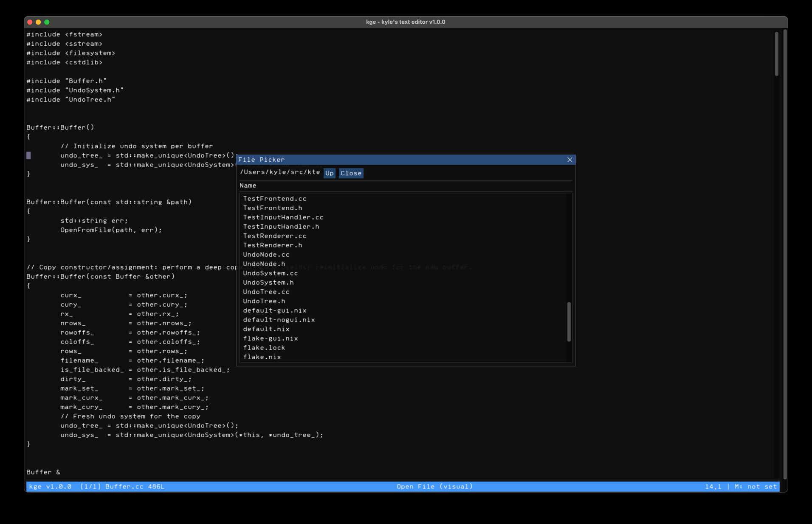

kte - Kyle's Text Editor



Vision
-------
kte is a small, fast, and understandable text editor with a
terminal-first UX and an optional ImGui GUI. It modernizes the
original ke editor while preserving its familiar WordStar/VDE‑style
command model and Emacs‑influenced ergonomics. The focus is on
simplicity of design, excellent latency, and pragmatic features you
can learn and keep in your head.

I am experimenting with using Jetbrains Junie to assist in
development, largely as a way to learn the effective use of agentic
coding. I worked with the agent by feeding it notes that I've been
taking about text editors for the last few years, as well as the
sources from the original ke editor that is all handwritten C.

Project Goals
-------------

- Keep the core minimal and readable; favor straightforward data
  structures (gap buffer, piece table) and incremental evolution.
- Round‑trip editing of large files with low latency in a terminal
  environment.
- Preserve ke keybindings and command semantics wherever sensible;
  smooth migration for ke users.
- Provide a clean separation between core model, input, and rendering
  so a GUI can grow independently of the TUI.
- Minimize dependencies; the GUI layer remains optional and isolated.

Keybindings
-----------
kte maintains ke’s command model while internals evolve. Highlights (subject to refinement):

- K‑command prefix: `C-k` enters k‑command mode; exit with `ESC` or
  `C-g`.
- Save/Exit: `C-k s` (save), `C-k x` or `C-k C-x` (save and exit),
  `C-k q` (quit with confirm), `C-k C-q` (quit immediately).
- Editing: `C-k d` (kill to EOL), `C-k C-d` (kill line), `C-k
  BACKSPACE` (kill to BOL), `C-w` (kill region), `C-y` ( yank), `C-u`
  (universal argument).
- Navigation/Search: `C-s` (incremental find), `C-r` (regex search),
  `ESC f/b` (word next/prev), `ESC BACKSPACE` (delete previous word).
- Buffers/Files: `C-k e` (open), `C-k b`/`C-k p` (switch), `C-k c`
  (close), `C-k C-r` (reload).
- Misc: `C-l` (refresh), `C-g` (cancel), `C-k m` (run make), `C-k g`
  (goto line).

See `ke.md` for the canonical ke reference retained for now.

Build and Run
-------------
Prerequisites: C++17 compiler, CMake, and ncurses development headers/libs.

Dependencies by platform
------------------------

- macOS (Homebrew)
    - Terminal (default):
        - `brew install ncurses`
    - Optional GUI (enable with `-DBUILD_GUI=ON`):
        - `brew install sdl2 freetype`
        - OpenGL is provided by the system framework on macOS; no package needed.

- Debian/Ubuntu
    - Terminal (default):
        - `sudo apt-get install -y libncurses5-dev libncursesw5-dev`
    - Optional GUI (enable with `-DBUILD_GUI=ON`):
        - `sudo apt-get install -y libsdl2-dev libfreetype6-dev mesa-common-dev`
        - The `mesa-common-dev` package provides OpenGL headers/libs (`libGL`).

- NixOS/Nix
    - Terminal (default):
        - Ad-hoc shell: `nix-shell -p cmake gcc ncurses`
    - Optional GUI (enable with `-DBUILD_GUI=ON`):
        - Ad-hoc shell: `nix-shell -p cmake gcc ncurses SDL2 freetype libGL`
    - With flakes/devshell (example `flake.nix` inputs not provided): include
      `ncurses` for TUI, and `SDL2`, `freetype`, `libGL` for GUI in your devShell.

Notes
-----

- The GUI is OFF by default to keep SDL/OpenGL/Freetype optional. Enable it by
  configuring with `-DBUILD_GUI=ON` and ensuring the GUI deps above are
  installed for your platform.
- If you previously configured with GUI ON and want to disable it, reconfigure
  the build directory with `-DBUILD_GUI=OFF`.

Example build:

```
cmake -S . -B cmake-build-debug -DCMAKE_BUILD_TYPE=Debug
cmake --build cmake-build-debug
```

Run:

```
./cmake-build-debug/kte [files]
```

If you configured the GUI, you can also run the GUI-first target (when
built as `kge`) or request the GUI from `kte`:

```
./cmake-build-debug/kte --gui [files]
# or if built/installed as a separate GUI target
./cmake-build-debug/kge [files]
```

GUI build example
-----------------

To build with the optional GUI (after installing the GUI dependencies listed above):

```
cmake -S . -B cmake-build-debug -DCMAKE_BUILD_TYPE=Debug -DBUILD_GUI=ON
cmake --build cmake-build-debug
./cmake-build-debug/kte --gui [files]
```

Status
------

- This project is a hobby text editor meant to be my personal editor. I
  do not warrant its suitability for anyone else.
